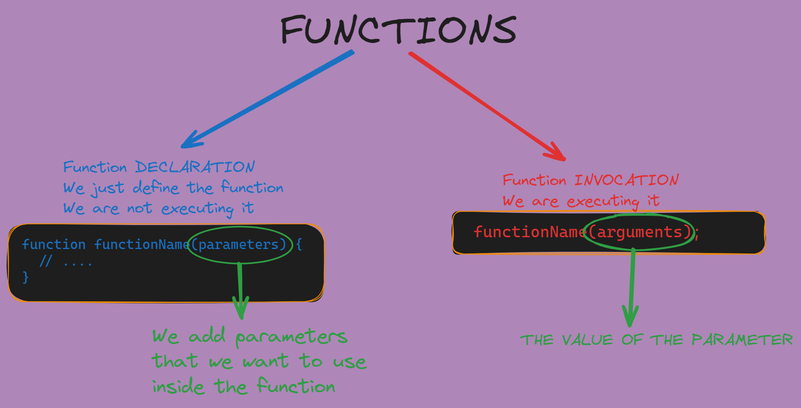

# Arrays and functions

In this class we learned about arrays and functions in JavaScript.

Remember the difference between declaration and initialization of a variable?
    
```javascript
    let myVariable; // Declaration
    myVariable = 5; // Initialization
```

The same applies to arrays and functions. We can declare them and then initialize them.


